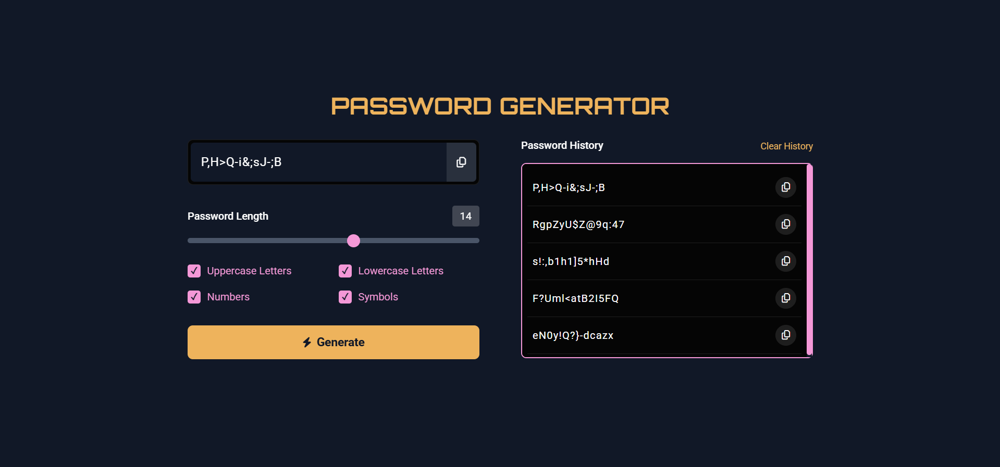

# 🔐 Password Generator

<p>Um gerador de senhas simples, responsivo e funcional, criado com HTML, CSS, JavaScript e Tailwind CSS.</p>
<p>Este projeto foi desenvolvido com foco em usabilidade, design moderno e experiência do usuário, sendo ideal para praticar conceitos de DOM, lógica de programação e estilização com Tailwind.</p>

## ✨ Funcionalidades

- ✅ Geração de senhas aleatórias com opções personalizáveis
- ✅ Histórico de senhas geradas
- ✅ Botão de cópia para cada senha
- ✅ Estilo moderno usando Tailwind CSS
- ✅ Persistência de histórico mesmo após fechar o navegador. O histórico só será apagado se o usuário clicar no botão "Clear History"

## 📦 Tecnologias utilizadas

- HTML5
- JavaScript
- Tailwind CSS

## 📸 Preview



## 🚀 Como usar

1. Clone o repositório:
   ```bash
   git clone https://github.com/anakessia/password-generator.git
   
2. Abra o arquivo `index.html` no navegador.

Nenhuma instalação adicional é necessária, pois é um projeto 100% front-end.

## 💡 Aprendizados
Esse projeto foi minha primeira experiência utilizando o Tailwind CSS, e me ajudou a entender sua abordagem utilitária para estilização. Também foi uma ótima forma de praticar lógica com JavaScript e trabalhar com armazenamento local (localStorage) para manter os dados salvos no navegador.

## 📌 Observação
O histórico de senhas é salvo automaticamente no navegador e permanece mesmo após fechá-lo. O histórico só será apagado caso o usuário clique em "Clear History".

📄 Licença
Este projeto está sob a licença MIT. Fique à vontade para usar, modificar e compartilhar.
<p>Desenvolvido por Ana Kessia.</p>
